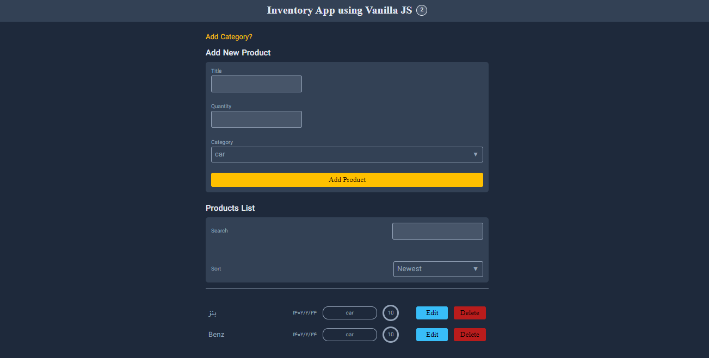

# Inventory App Project 🧾

## [App Online Link](https://inventory-oop-app.netlify.app/)

## App Demo

---

## Description

In this Project, you can Create Categories related to the Product you want, and then Create your Product and place it in any Desired Category, as well as Choose the Name, Number and Category for your Product;

On the other hand, you can Search and Filter among the Created Products and Sort Products from New to Old and vice versa based on Product Creation Date.

In the Product List section, you can Edit or Delete any Product and see the Total Number of Created Products.

This Modular Web App is Developed in Object-Oriented Programming Style (OOP)

## Features

- Create Category
- Create Product (Place the Product in any desired Category)
- Delete Product
- Edit Product
- Save Categories and Products in Local Storage
- Search and Filter Products
- Sort Products from New to Old and vice versa based on Product Creation Date.
- Calculation of the Total Number of Products Created

## Tips 📌

- fully responsive for mobile, tablet, laptop and desktop

## Web Development Technologies

- HTML5 (Semantic HTML)
- Pure CSS3 (FlexBox)
- Vanilla JavaScript

## Contact Me

 

